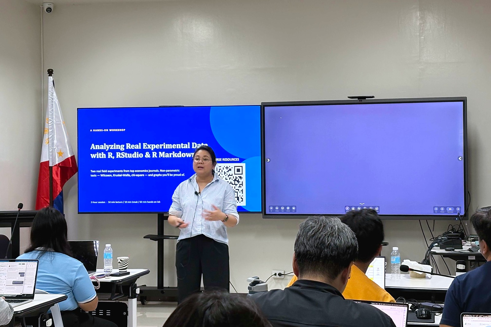
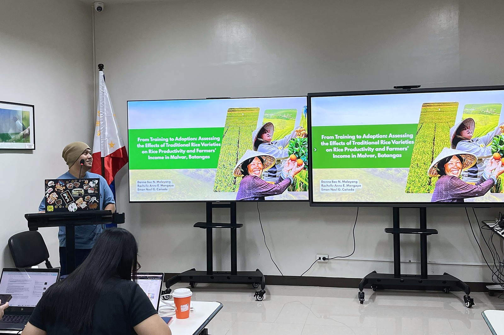
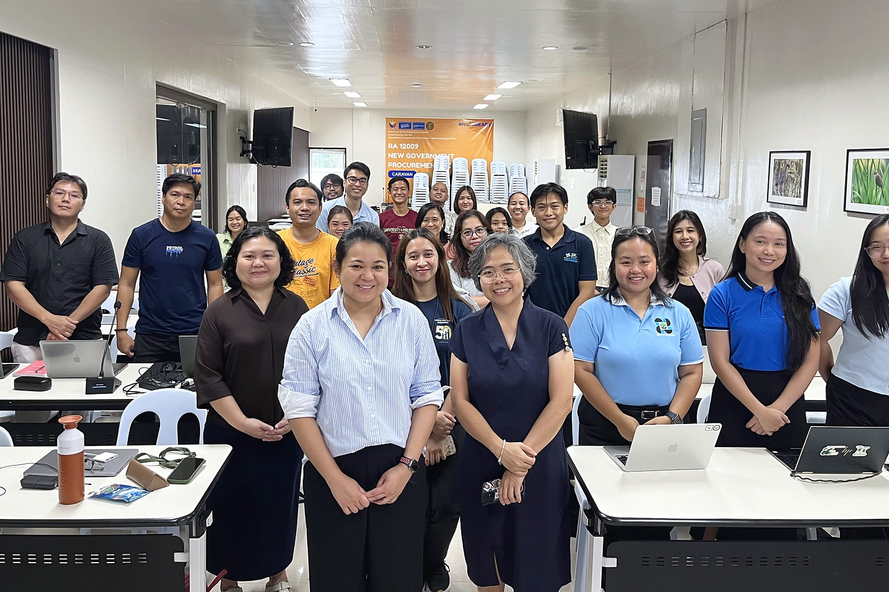

From 23 to 25 September 2026, Dr. Anna Lou Abatayo led the workshop *From Experimental Design to Data Analysis in Economics* at the University of the Philippines Los Baños (UPLB). The three-day, hands-on workshop was hosted by the UPLB Department of Economics and held under the DOST-PCAARRD Balik Scientist Program, which invites Filipino scientists working abroad to share their expertise with research and academic institutions in the Philippines.

Experiments are increasingly used to test how people respond to policies before those policies are rolled out, and to evaluate them once they are in place. The workshop was designed to take participants through one complete research cycle: from formulating a research question and designing an experiment, to analysing the resulting data and presenting the findings.

The first part of the workshop focused on designing experiments in economics: defining treatments and controls, randomisation, and the role of incentives in eliciting real behaviour. Participants then moved to hands-on sessions in R, RStudio and R Markdown, where they worked with data from published field experiments. They applied non-parametric tests such as Wilcoxon, Kruskal-Wallis and chi-square tests, and learned to produce clear, reproducible graphs and reports.

Throughout the workshop, participants worked in teams to develop their own experimental designs, with one-on-one feedback along the way. On the final day, eight teams presented their designs. The topics reflected the breadth of policy questions in the Philippines, including:

- voluntary restraint among municipal fishers facing commercial access to municipal waters;
- premium pricing for higher-quality raw milk among dairy farmers in Batangas and Quezon;
- the effects of traditional rice varieties on productivity and farmers’ income in Malvar, Batangas;
- the role of irrigators’ associations and irrigation infrastructure in farmer cooperation;
- the behavioural effects of municipal payment for ecosystem services (PES) schemes;
- trust in the aftermath of Super Typhoon Pepito in Catanduanes;
- text-message reminders and repeat HIV testing; and
- community acceptance of the Pax Silica project.

Several of these designs connect directly to EconSES research on marine systems and behaviour in the commons, such as how fishers respond to unequal access to shared resources and how institutions shape cooperation in irrigation systems.

EconSES thanks all participants for their energy and engagement, the UPLB Department of Economics for hosting the workshop, and DOST-PCAARRD for supporting it through the Balik Scientist Program. We look forward to seeing these experimental designs develop into full research projects.
