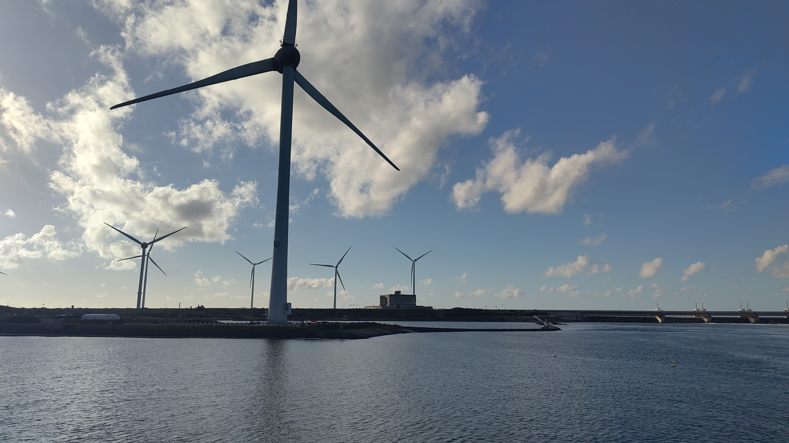
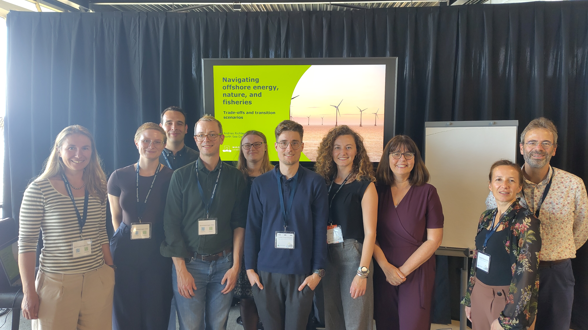

As the North Sea gets more crowded, decisions about offshore wind, nature restoration, and fisheries are becoming more contested, often under deep uncertainty about climate change and a shifting geopolitical landscape. Too often the trade-offs stay implicit, which makes it hard to see who benefits, who bears the costs, and where thresholds may be crossed. At the North Sea Days, we convened a session to make these trade-offs explicit, together with partners from Wageningen Social and Economic Research, DMEC, Central Bureau of Statistics, Stichting De Noordzee, NIOZ, and Breda University of Applied Sciences, and drawing on the NO-REGRETS and DISPLACE projects.

Around four tables, participants worked through one dilemma each, and three ideas stood out. Thresholds are not only ecological: a limit that is safe for the whole system may already be the end of the road for a single sector, so the question becomes who sets the limit, and for whom. Spatial change also comes with a price tag: for fisheries, compensation can mean more than money, from new gear to repurposing the fleet toward seaweed farming or services around wind farms, with government stimulating rather than forcing the shift. And the way forward has to be effective, not just agreeable, because a pathway everyone can live with is not automatically one that works.

Making such trade-offs explicit is a first step toward strategies that hold up across uncertain futures. The input feeds into our research and into the discussion on the Programma Noordzee 2028–2033. 
