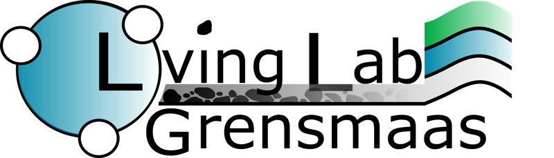
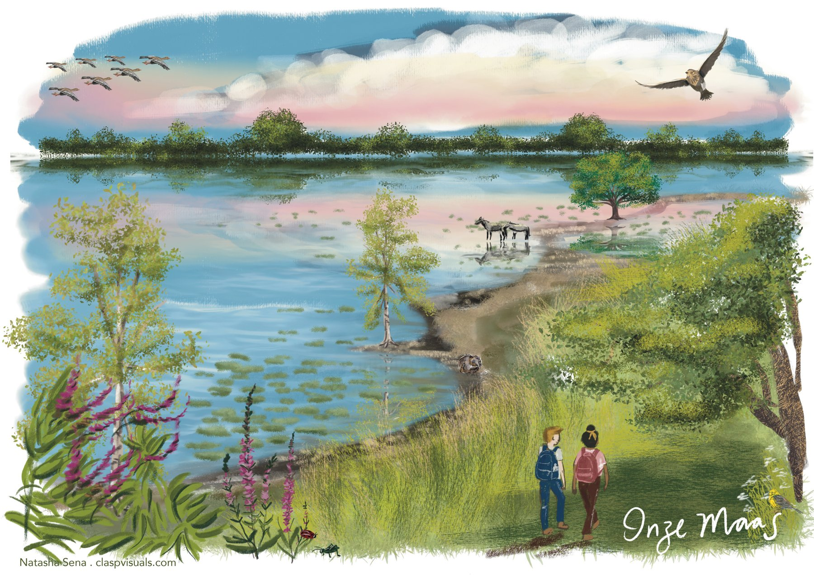
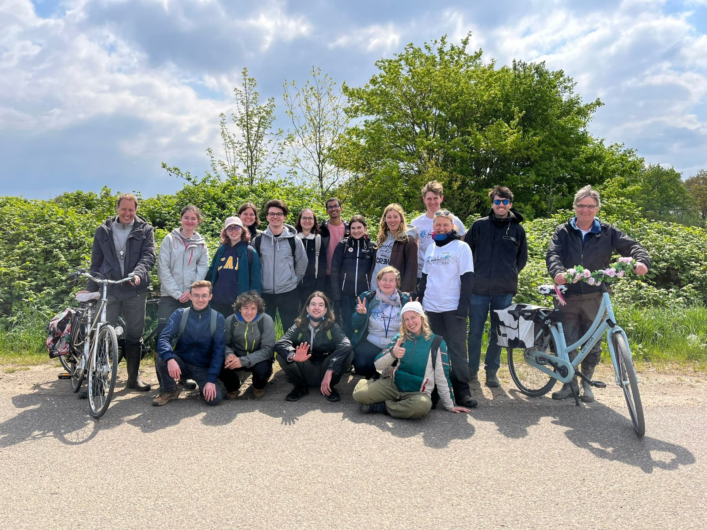

What happens when you give a river back its room? Along the Grensmaas, the stretch of the Meuse that forms the
border between the Netherlands and Belgium, the largest river restoration project in the country turned gravel
pits and dikes into a wilder river that floods more safely, brings nature back and attracts new residents.
**Crossing Borders at the Grensmaas** (NWO, *Living Labs in the Dutch Delta*, 2020–2026), led by Andries Richter
at Wageningen University, used this unique experiment to ask a simple but hard question: what makes a
nature-based solution a success, and for whom?

*"Onze Maas", an illustration of the restored Grensmaas by Natasha Sena (claspvisuals.com).*

For six years, ecologists, economists and social scientists from Maastricht University, Wageningen University,
Delft University of Technology, the University of Twente and Hanze University of Applied Sciences worked side by
side with residents, river managers and local partners. They followed fish, plants and insects returning to the
restored floodplains, measured how flood risk and the new river landscape show up in house prices, tested whether
better information changes how households prepare for floods, and listened to the stories people tell about their
river. The answers are encouraging but not simple: nature recovers, the project creates lasting value, yet trust,
fairness and whose voice counts turn out to matter as much as ecology and economics. That lesson, the difference
between success in outcomes and success in process, is at the heart of the Living Lab's legacy.

*The Living Lab team during the Climate Café on a fish-friendly Grensmaas, April 2022.*
