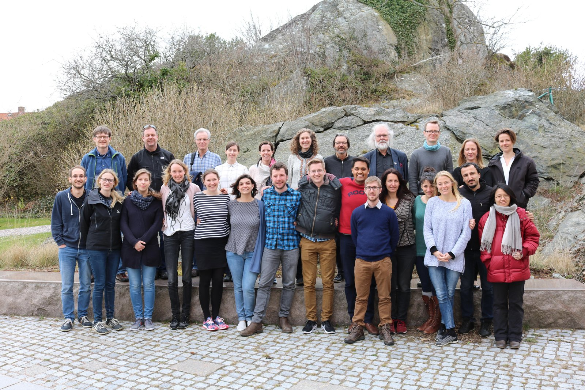

MARmaED (Marine Management and Ecosystem Dynamics under Climate Change; Horizon 2020 Marie Skłodowska-Curie Innovative Training Network, 2015–2019) brought together 15 PhD candidates and their supervisors at eight European partners. Europe's seas are under combined pressure from climate change, biodiversity loss and fishing, and understanding them requires bridging disciplines that rarely meet: physical oceanography, genetics, ecophysiology, ecology, statistics and economics. The network studied these pressures along three lines, from physics to biology, from individuals to food webs, and from science to ecosystem-based management, and gave the PhD candidates the chance to see their research in practice through secondments at ICES, WWF, the Marine Stewardship Council, research institutes and the fishing industry. Two of the PhD projects were hosted at Wageningen University: Esther Schuch studied the value of information in fisheries management, and Sanmitra Gokhale developed ways to manage income risk in European fisheries.

*MARmaED PhD candidates, supervisors and partners at the network's annual meeting, 2017.*
