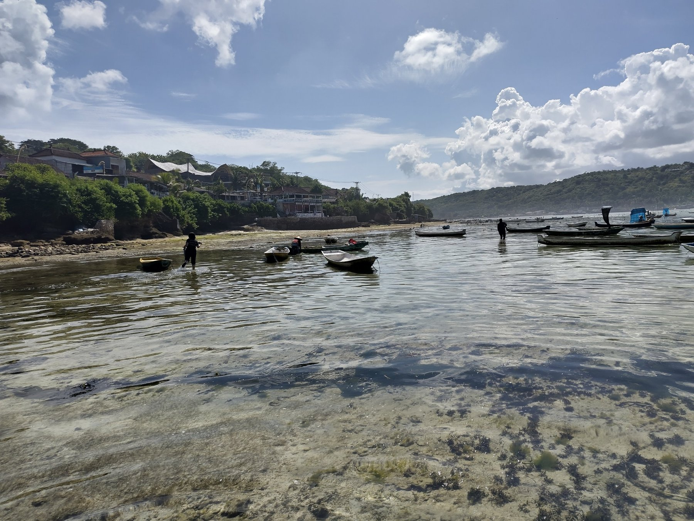
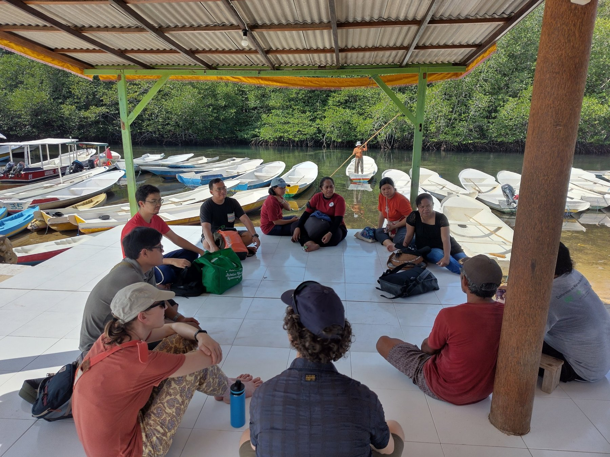

Tourism is a double-edged sword for marine protected areas (MPAs). Visitors put pressure on coral reefs through
crowding, sewage and pollution, yet tourism revenues can also pay for conservation and support local
livelihoods. **INREEF**, an interdisciplinary research and education programme funded by the Wageningen
Interdisciplinary Research and Education Fund (INREF), brings together Indonesian, Dutch and Caribbean
researchers, conservation organisations and policymakers to understand how fluctuating tourism, together with
climate change, fishing and pollution, affects the health of coral reefs, the livelihoods and cohesion of coastal
communities, and their capacity to govern their reefs. Its aim is to develop tools to assess and monitor the
resilience of MPAs, and to design governance measures that protect coral reefs in an era of changing tourism and
climate.

*Low tide near Nusa Lembongan, Bali, where tourism, local livelihoods and coastal ecosystems meet. March 2024.*

EconSES focuses on the human side of reef resilience, through several PhD projects. They ask how policy can
govern pollution flows as tourist numbers rise and fall, who bears the costs and who reaps the benefits of MPAs,
how these effects play out along local food chains and between women and men, how land and sea tenure can secure
stable, long-term support for conservation through tourism, and how tourism, MPAs and reef health are linked in
the Dutch Caribbean.

*INREEF researchers and local partners discussing during fieldwork at the mangroves of Nusa Lembongan, Bali,
March 2024.*

More about the programme, the full team and its publications is available on the
[INREEF website](https://inreef.org/).
