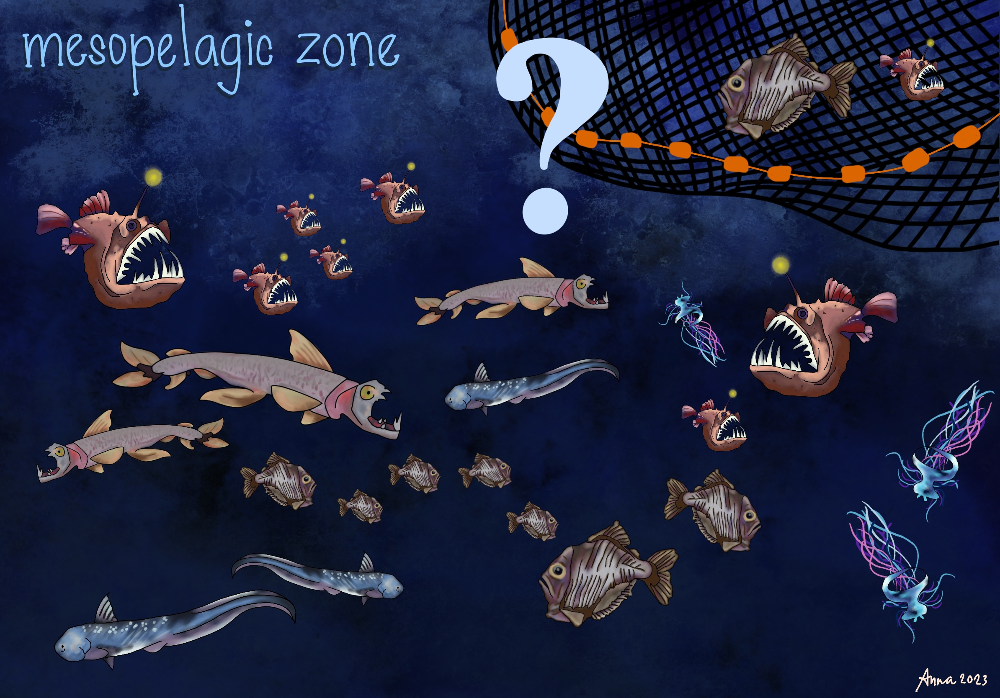

---
title: Marine Systems
summary: We study the interactions between fisheries, marine ecosystems, and coastal communities to inform sustainable ocean management and marine conservation policies.
weight: 1
type: landing

sections:
  - block: markdown
    content:
      title: Marine Systems
      text: |
        

          
        

        

        Marine ecosystems support biodiversity, food security, and livelihoods for millions 
        of people, yet they face increasing pressures from overfishing, climate change, 
        and habitat degradation. Our research examines the interactions between fisheries, 
        marine ecosystems, and coastal communities, using spatial data, experiments, and 
        policy analysis to understand human behavior and evaluate conservation interventions 
        such as marine protected areas. We aim to generate evidence that supports sustainable 
        fisheries management and effective ocean governance.
        

  - block: collection
    content:
      title: Related Projects
      page_type: project
      filters:
        tag: Marine Systems
    design:
      view: compact
  - block: collection
    content:
      title: Related publications
      page_type: publication
      count: 0
      order: desc
      filters:
        tag: Marine Systems
    design:
      view: citation   
---