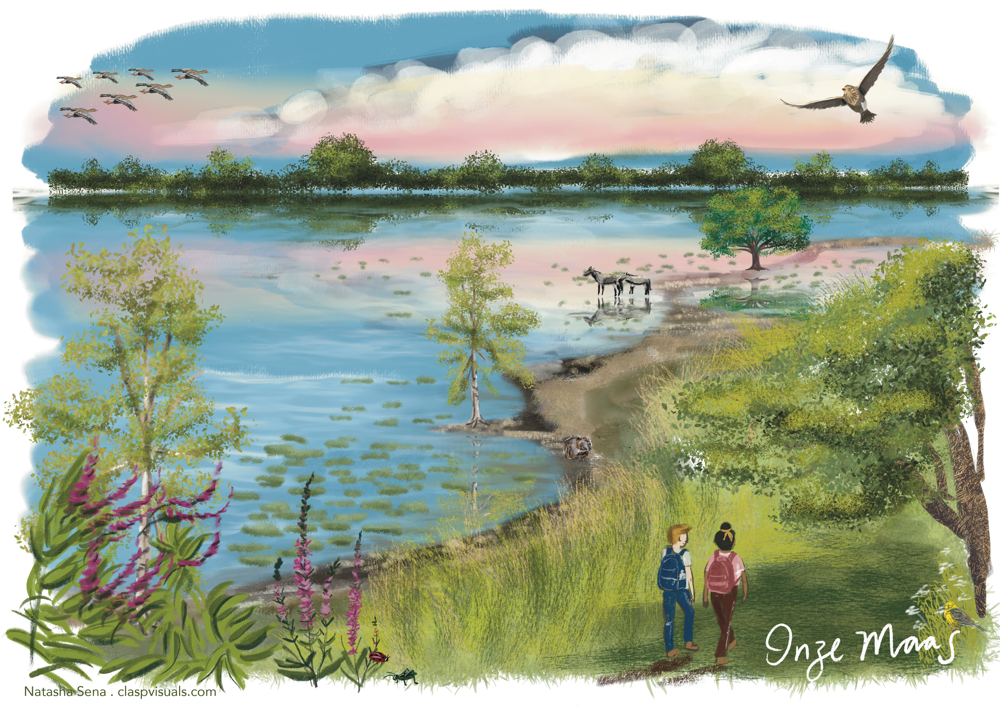

---
title: Nature-based Solutions
summary: understanding
weight: 2
type: landing

sections:
  - block: markdown
    content:
      title: Climate Change
      text: |
        

          
        

        

        Add a short description of this research domain here.  
        You can write multiple sentences or even multiple paragraphs, and the
        text will remain justified across the full width of the page.
        

  - block: collection
    content:
      title: Related publications
      page_type: publication
      count: 0
      order: desc
      filters:
        tag: Nature-based Solutions
    design:
      view: citation
---